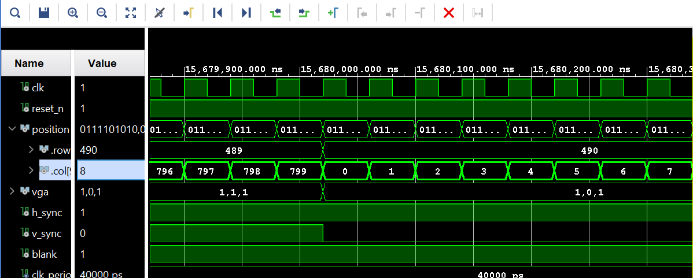
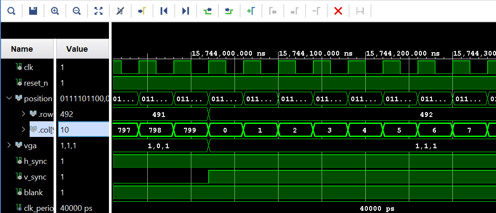
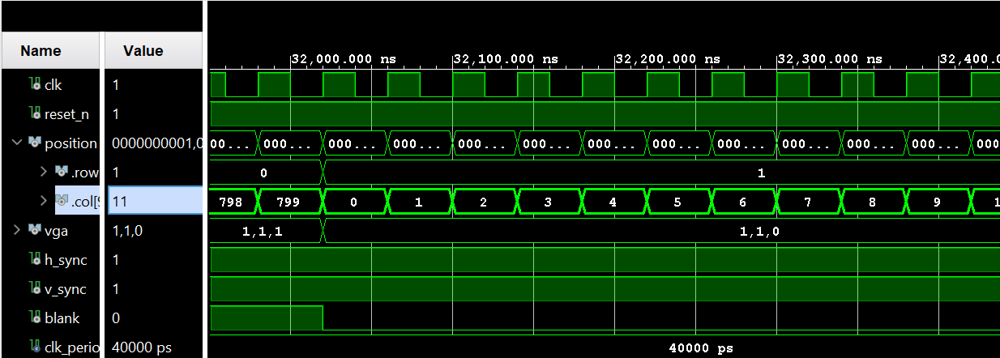
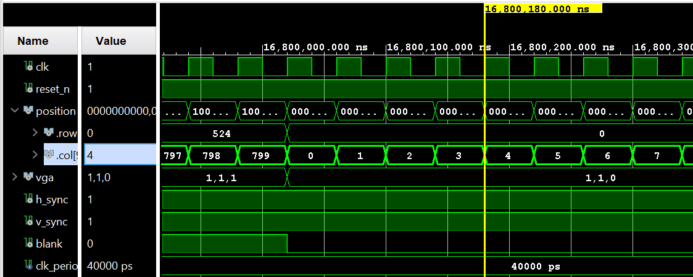
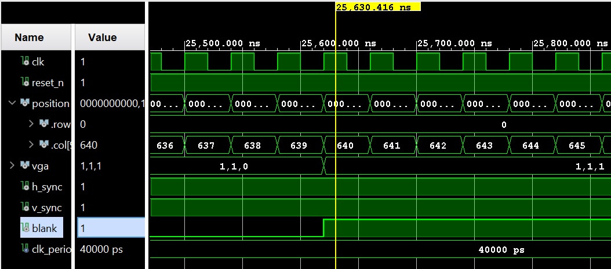
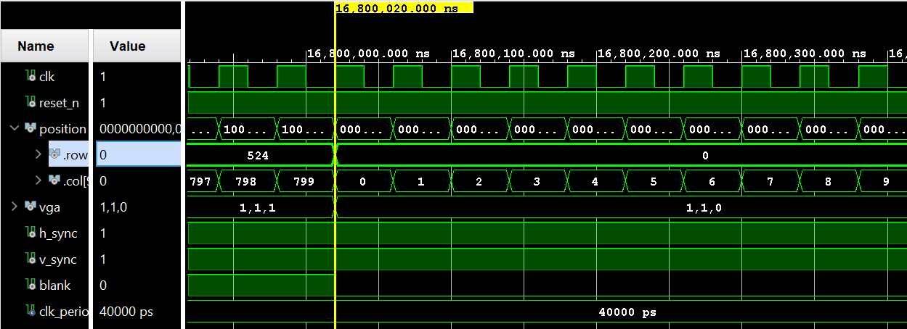
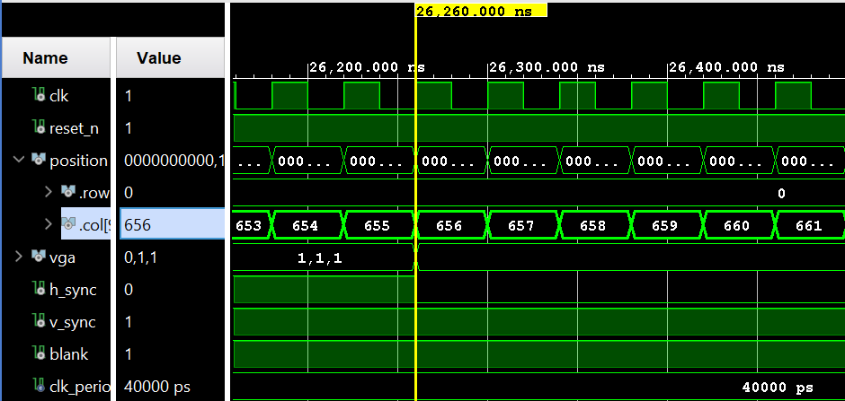
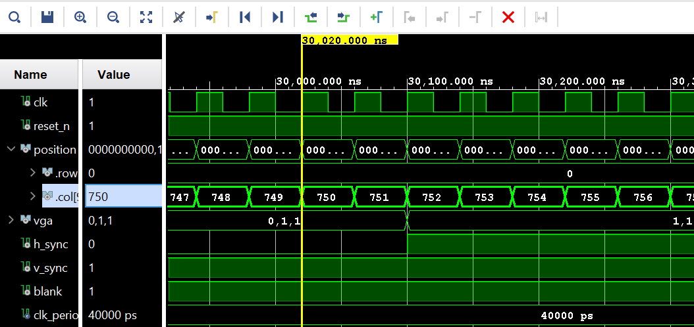
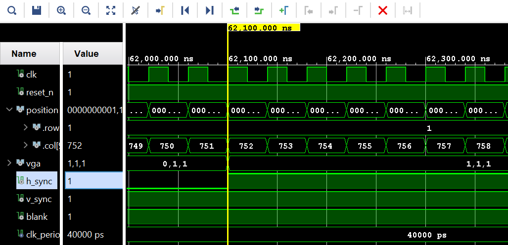

Intro : The purpose of the lab is to create an oscilliscope window with standarad grid format and hash marks. The window will display two active channels toggled by switches and two trigger indicators moved back and forth, up and down with the use of four seperate buttons.

Design/Implementation : 

.jpg>)

.jpg>)

The list of components we were tasked with designing were the vga_signal_generator, color_mapper, numeric_stepper, and Lab1

Lab1 - this was the top level entity where all the other design components were connected together to create the full functionality. This connected the signals from physical inputs such as bumps and switches to our channels and triggers on the oscilliscope window. The inputs include the clk, reset_n, btn (4 downto 0), and sw (4 downto 0). The clk is the internal clock to the system which we catch our button and switch signals on. The reset_n is a button on the board that is used in every entity to reset all signals and states to the default values. 2 of the four buttons are mapped to up and down which are signals that go into the numeric_stepper entities to flag a user input and change the trigger values for voltage. The other two buttons are left and right which serve the same function but flag an input to change trigger time. The fifth center button is of no use to the this current implementation. Switch one "sw(0)" and switch two "sw(1)" are used to control the switch enable signals on the oscilliscope window, it controls the color mapper in the vga entity deciding whether or not a channel is drawn on the oscilliscope window or not. The rest of the switches are not used in the current implementation. The outputs of lab1 are tmds, tmdsb, and led (4 downto 0). The tmds and tmdsb were not created by us and convert out VGA signal into a useful hdmi signal that we use to display onto monitors. The leds are set to be high at all times as they are not mapped to anything in the current implementation.

numeric_stepper - There are two numeric steppers instantiated inside of the lab entity, one for the time trigger and another for the volt trigger. The numeric stepper detects the input from a user from a button and changes the integer values indicating the value for the volt or trigger. The button changes the volt and time level by some pre determined delta. The inputs to the entity are clk, reset_n, en, up, and down. clk is the signal clock where inputs are detected on the rising edge. reset_n is an input same as lab1 used to reset the triggers to default values. en is the enable which is connected to one of the switches which when active enables the trigger to be drawn on the oscilliscope and moved through the button and counters. Up and down are mapped to two buttons which are the signals which are detect inputs from the buttons, one causes an increase in the level and one decreases the level of the triggers. 

color_mapper - The color mapper decides what colors are to be displayed for a pixel based on location (column and row counts), additionally bounding the scope window to make sure nothing is drawn on the monitor outside of the grid. The inputs are position, ch1, ch2 , and trigger. The input position contains data about which cloumn and row the computer is currently on, if the position is within the grid then either the channels or triggers are able to be printed. ch1 and ch2 contain signals such as active and enable. The color mapper assigns the pixel the color of the channels when both the active and enable signal for the channel are active. The color mapper prints white on the geometry of the grid to create the solid oscilliscope. trigger contains signals that track the position on the column for the time trigger and position on the row for the voltage trigger. When the trigger is within the grid and enabled the triangle is assigned the yellow color. The output is a signal called color which is assigned to the pixel based on the mentioned characteristics and comparisons which is converted to be used by HDMI then displayed on the monitor. 

vga_signal_generator - the signal generator iterates through the pixels of the display generating signals one row at a time. As the signal generator iterates it controls signals that describe the regions and timing of the display that indicate and generate the positioning of the pixels. The inputs are reset_n, and clk. The clk for the siganl generator runs at a different frequency then the system clock to properlly iterate through columns and rows. The reset_n signal same as other entities defaults all the signals in the component. The outputs are vga and position. The position is a signal tracking the column and row of the current position for the color mapper to compare against. The vga contains signals that describe where the current pixel position is and if its a region to be drawn on or that is used for timing. 

TEST/DEBUG : 

         

Problem 1 - The first major problem and solution was grasping an understanding of how VHDL structures and compiles the files for simulation and testing. The top of the heirarchy is very important to note when running the bitstream. There were multiple errors I couldnt seem to understand or fix but it was because the top file could not see all the enitities and architectures contained. 

Problem 2 - One of the biggest problems I encountered was properly changing the v and h sync signals as well as the blank signals. The part of the blank signal that relied on the columns were easy to implment as they would change from high to low at the same time that the column rolled over. The timing worked out to change on the correct clock edge and signals. However, v_sync and when blank changed based on the row caused timing errors where the signals would change on the wrong clock edge or timing. The columns and rows were aligned in critical spots for determining the signal and when only looking at the rows it would change at the wrong time. The solution was to make comparisons and changes when both the column and row changed rather then focusing only on the rows. 

Problem 3 - I was confused on the purpose of channel enable vs channel active signals. I was questioning why it couldnt be possible to have the same effects with one signal. Through clarification I understood that the active signal was essential for the logic that controlled the shape of the channel being displayed on the oscilliscope while enable was simply the toggle for whether you would or wouldnt see the signal at all regardless of what it was.

The testing and debugging were handled by sifting through the signal waves step by step confirming the transitions between signals and moving on to the next steps once simulations were completly varified to be correct. Made sure to sweep over each scenario and mutliple full cycles to ensure weird behaivor did not occur over time.

Results : 

Complete functionality was demonstrated over teams through recording of the lab working. The first major milestone was on Feb.4 where I was able to generate a solid color to the monitor which meant the signal generator was sweeping through all the columns and all the rows, however the distinction of colors did not work. On Feb.5 I was able to have the color mapper logic discern the pixel being output creating the oscilliscope grid and triggers in the default position. On Feb.5 I was able to toggle the channels being displayed using the switches. On Feb.6 I was able to map the numeric steppers to the buttons and move the trigger signals. 

Conclusion : I learned the fundamental function of a VGA display while relearning and solidifying my skills in VHDL. I learned how to better mangae and read the file structure in Vivado to correctly simulate and test implementations while solving a problem. I learned to ask for help more often and early. While I value learning through struggle and figuring out on my own the structure of the academy doesnt allow the time to achieve learning through this way for the most part and I need to reach out for help and collaberation to succeed. I would create a definitive list of all the componenents we needed to create following the block diagram. I also learned how to be careful when deciding signals between combinational or in a process. There are timing contraints that change depending on how you implement logic. The correct balance speeds up the process of coding and creating the lab.