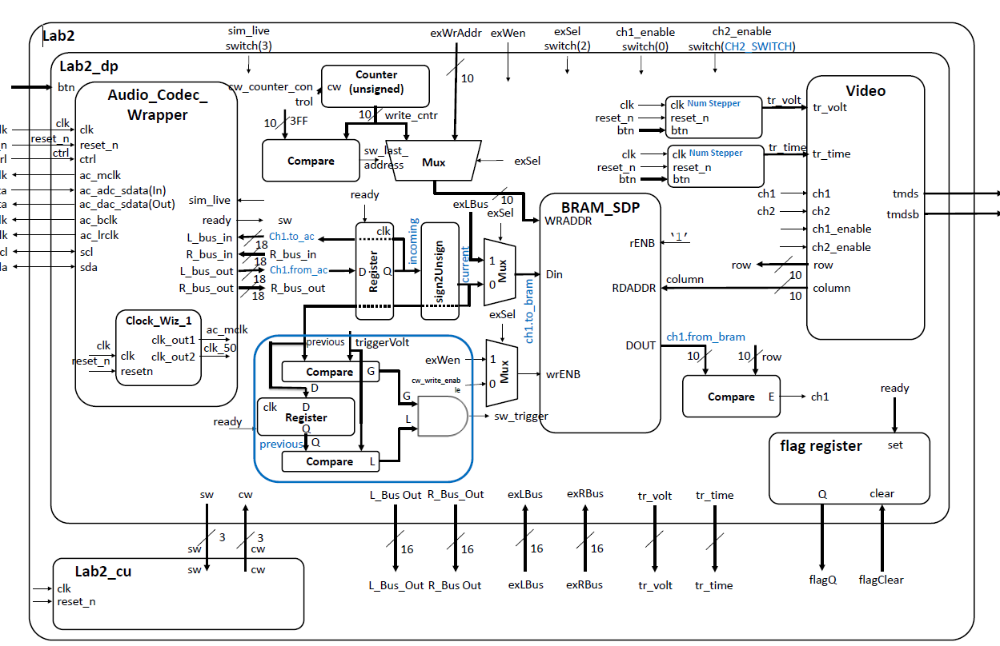
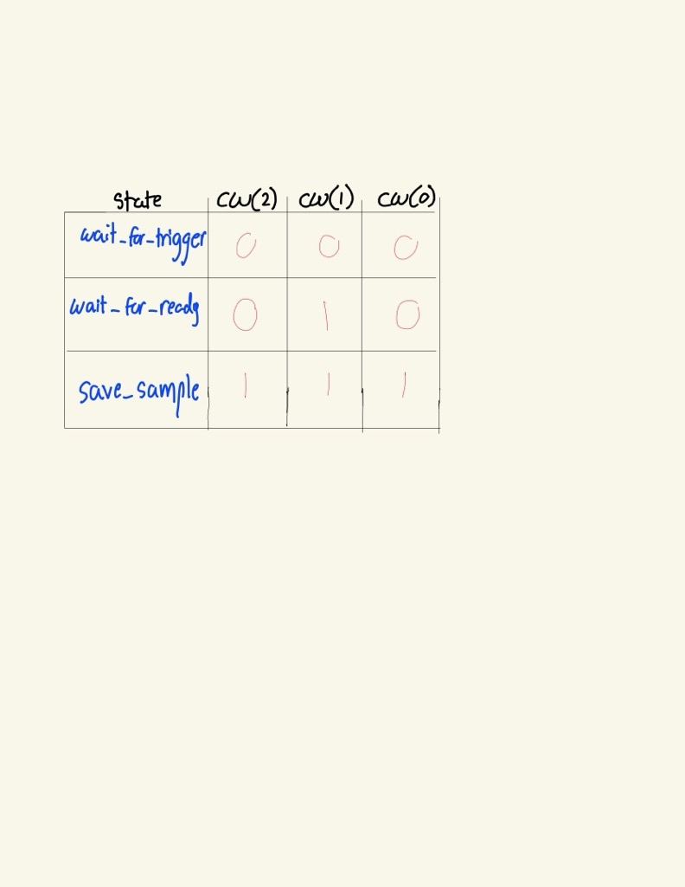

Intro : The purpose of the lab is to create an oscilliscope window with standarad grid format and hash marks. The window will display two active channels toggled by switches and two trigger indicators moved back and forth, up and down with the use of four seperate buttons. In addition the oscilliscope will display live audio wave forms centered about the vertical trigger. 

Design/Implementation : 

-1.jpg>)

Tasked with creating the Lab2_cu (control unit) , Address Counter, trigger_detector, and other connections between video/audio_codec to the BRAM

Lab2 - this was the top level entity where all the other design components were connected together to create the full functionality. This connected the signals from physical inputs such as bumps and switches to our channels and triggers on the oscilliscope window. The inputs include the clk, reset_n, btn (4 downto 0), and sw (4 downto 0). The clk is the internal clock to the system which we catch our button and switch signals on. The reset_n is a button on the board that is used in every entity to reset all signals and states to the default values. 2 of the four buttons are mapped to up and down which are signals that go into the numeric_stepper entities to flag a user input and change the trigger values for voltage. The other two buttons are left and right which serve the same function but flag an input to change trigger time. The fifth center button is of no use to the this current implementation. Switch one "sw(0)" and switch two "sw(1)" are used to control the switch enable signals on the oscilliscope window, it controls the color mapper in the vga entity deciding whether or not a channel is drawn on the oscilliscope window or not. Switch 2 controls the MUX selectors for switching between the addresses being counted. Switch(3) is used to switch between live and simulated audio

trigger_detector - The trigger detector takes the current trigger voltage level as an input and compares the current sample from the audiocodec. It checks to see that the signal is greater and less then the current voltage trigger at which point it drives sw_trigger.

address_counter - I used the modulus roll over counter from the previous labs and assignments to create the address counter. When exSel is 0 the BRAM writes the data at the adress of the counter. When the counter reaches the last address, it rolls over to 0 while at the same time driving sw_last_address.

Lab2_cu - The lab 2 control unit is what decides whether the counter holds or increments, as well as enabling the BRAM to write data from the BRAM. The counter is controlled by cw(1 downto 0) which correlates to the timer enable and reset_n. cw(2) controls the write enable for the BRAM. The control unit is designed as a FSM where the status words sw(2 downto 0) are the signals that control the state transitions. sw_trigger decides the state transition between wait_for_trigger and wait_for_ready, with a 1 causing a transition and 0 holds the current state. wait_for_trigger initialises the counter and BRAM enable so nothing writes or counts and the counter starts from 0. wait_for_ready transition is decided by sw_ready with 1 being a transition and 0 keeping the state the same. The last state is save_sample which makes the counter increment and allows the BRAM to write data. sw_last_address controls save_sample with a 0 going back to wait_for_ready, and 1 to wait_for_trigger where the process will start over again. 

Datapath going to BRAM - The data coming from the Audio Codec Wrapper is 18 bits of data. This data is to wide for a proper comparison so in order to compare to the BRAM the data is made from singed to unsigned and only the top 10-8 bits are taken. The address to read from comes from the Video component, the address of the video is compared with the address of the counter when they are equal the BRAM outputs the data.

TEST/DEBUG : 

Problem 1 - When sending the data to BRAM the data width is larger then the amount we want to see on the screen. We want the data being represented to fit on the resolution of the monitors we are working with. In order to do this we had to cut down the datapaths down to 8 or 10 bits of width to fit the screen. In class I learned why we took the top bits of the data as this esentially shrunk the data size while retaining the data we want to see. We also had to apply an offset in order for the signals to be centered along the grid.

Problem 2 - I was not entirely sure of the BRAM and all its ports. I did not know the difference between the two ports related to write enable where one allows for the upper half and lower half of the data incoming to be taken and the other write enable that was the main way of toggling whether or not the BRAM would display the data from the address of the counter correlating to the video address.

Problem 3 - Once I correctly  wired all the signals within the Datapath I was having issues with the FSM. Through EI I was able to get some feedback on the amount of states I was given and the transition between them. One of the states were improperly resseting the counter which caused the FSM to not progress through the states at all allowing only for the static signals to show. I was taught how I was able to reduce the amount of states and create a simple state transition with less confusing steps and less likely to break.

The testing and debugging were handled by generating the bitstream and checking the monitor for the correct implementation ensuring the data was being displayed correctly. Had the option of using the built in logic analyser however I couldnt properly implement it.

Results : 

Complete functionality was demonstrated over teams through recording of the lab working. The first major milestone was on Mar.2 where I was able to generate a solid color to the monitor which meant the signal generator was sweeping through all the columns and all the rows, The data displayed was the simulated audio from the BRAM, was able to display the live audi however it wasnt counting correct. Mar. 8 I was able to properly display both simulated and live audio. The trigger was also correctly controling channel 1 to start at the trigger arrow.

Conclusion : I learned interesting ways of manipulating data widths to fit the data coming in to display on the monitor. I was struggling at the last step to get proper transitions between states of the FSM machine, I was caught up within the data path and did not question the method of the FSM and this caused a lot of delay and frustration. I need to check all components thouroughly before assuming errors and making changes that would cause further issues. Spending time on paper to connect signals and write out potential connections before starting to code improved efficiency and success of the lab. Finally using the built in logic analyser to check signals live as the code is running to diagnose problems I wouldnt be able to see through manual checking, while I couldnt get proper implementation of it in this lab the tool will be useful for future labs and projects.